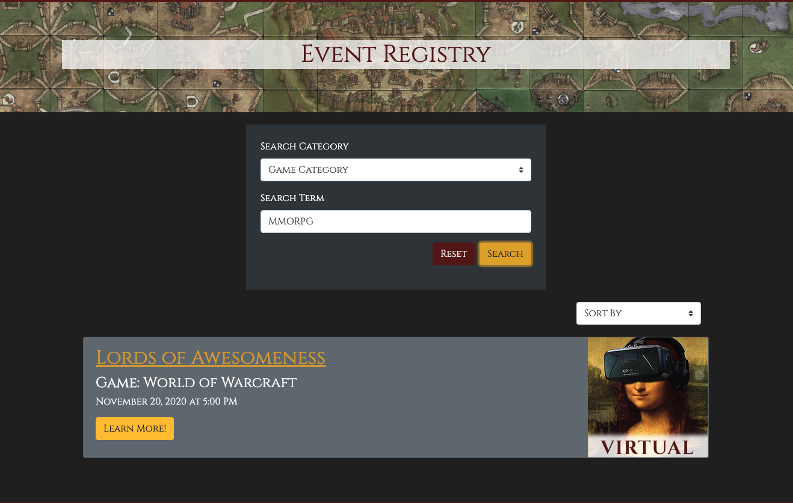
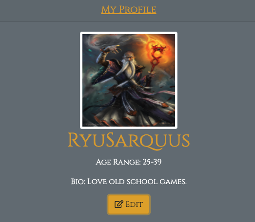
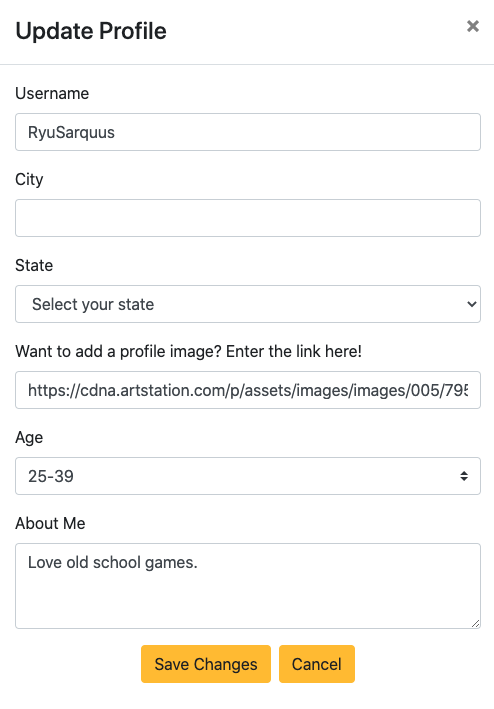
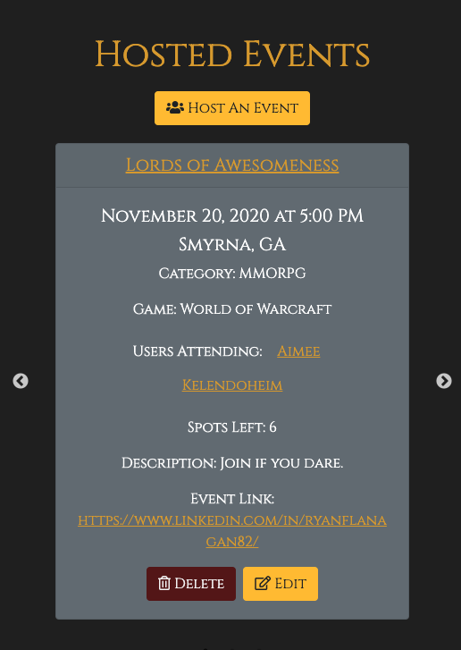
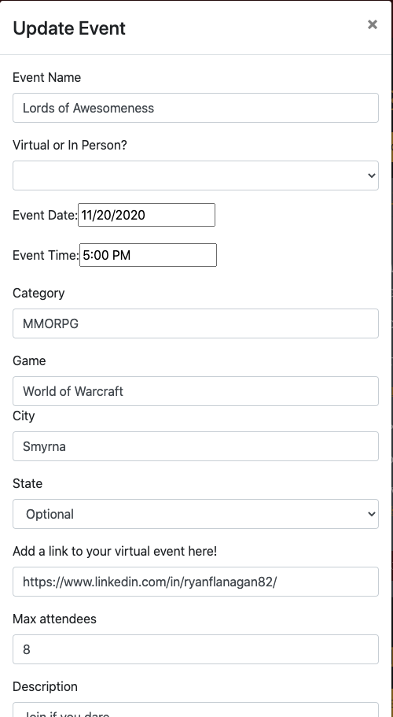

# gameknight-app

## Description
This is a game scheduling app that brings people together by helping users to browse, search for, or host in-person and virtual games.

## Deployed Application Link

This application is deployed on Heroku.

[Set up your next game event by visiting here.](https://gameknight-app.herokuapp.com/)

## Contents
This application provides users with the ability to immediately browse games or host them upon logging in or creating a user profile.

Users have the ability to search to filter or sort upcoming hosted games...

We clearly show which events are virtual...

and 

which are in-person...

In the dashboard page, users have views to their profile card with the ability to edit...

Hosts can clearly see all of their events with the default card being the closest event being hosted to the actual date.

.

Our Create Event Form is also easy for the user to provide their details and submit...

Events can also be updated or deleted by Hosts at any time...

We included an about us page and once the user clicks 'Logout' they will be required to log back in should they decide to create a new event or join another one.

## Credits and Contributions
We collectively want to say thank you to our TA Staff: Peter Colella, Christina Starr, Leif Hetland, Phil Simmons, and our instructor Jonathan Watson for their time and expertise throughout the duration of this project. 

We also want to thank our tutors who shared a few additional insights as well.

We experienced a few challenges along the way and they were instrumental in helping us troubleshoot to make our project a success.

## Technologies

This is a full-stack MERN application that adheres to MVC files structure requirements.

It includes full CRUD methods, as it provides the ability to create, read, update, and delete hosted game events.

Front End -

* HTML5 
* React-Bootstrap CSS
* JavaScript 
* REACT
* REACT-Datepicker
* REACT - Slick
* Moment.js
* Axios
* JSON Web Tokens

Back End -

* NoSql
* Mongoose 
* Node.js 
* Express.js  
* Heroku
* Path
* MongoDB Atlas

## Contact

Click the links below to find us on LinkedIn.

* [Ryan Flanagan](https://www.linkedin.com/in/ryanflanagan82/)
* [Aimee Esler](https://www.linkedin.com/in/aimee-esler-3bb31288/)
* [Aubrey Polk](https://www.linkedin.com/in/aubrey-polk-70886456/)
* [Dane Walsh](https://www.linkedin.com/in/thomasdwj/)

## License
Copyright 2020 - Templars of Palladium.

Ryan Flanagan / Aubrey Polk / Dane Walsh / Aimee Esler

Permission is hereby granted, free of charge, to any person obtaining a copy of this software and associated documentation files (the "Software"), to deal in the Software without restriction, including without limitation the rights to use, copy, modify, merge, publish, distribute, sublicense, and/or sell copies of the Software, and to permit persons to whom the Software is furnished to do so, subject to the following conditions:

The above copyright notice and this permission notice shall be included in all copies or substantial portions of the Software.

THE SOFTWARE IS PROVIDED "AS IS", WITHOUT WARRANTY OF ANY KIND, EXPRESS OR IMPLIED, INCLUDING BUT NOT LIMITED TO THE WARRANTIES OF MERCHANTABILITY, FITNESS FOR A PARTICULAR PURPOSE AND NONINFRINGEMENT. IN NO EVENT SHALL THE AUTHORS OR COPYRIGHT HOLDERS BE LIABLE FOR ANY CLAIM, DAMAGES OR OTHER LIABILITY, WHETHER IN AN ACTION OF CONTRACT, TORT OR OTHERWISE, ARISING FROM, OUT OF OR IN CONNECTION WITH THE SOFTWARE OR THE USE OR OTHER DEALINGS IN THE SOFTWARE.
